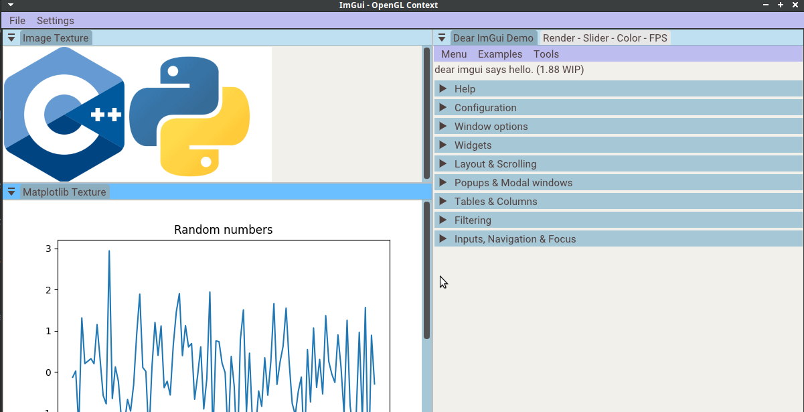

<h1 align="center"">ImGui Template - CMake</h1>

<p align="center">
  
  
  
  
</p>
                     
---

This project is a simple template to make desktop GUI apps with ImGui to be used with OpenGL, adding interoperability with Python using the pybind library. The template employs CMake as the build system, supporting Windows and Linux systems.

---

- [1. Requirements](#1-requirements)
- [2. Getting started](#2-getting-started)
- [3. Build](#3-build)

## 1. Requirements
                      
- [CMake](https://cmake.org/) (minimum version 3.20)
- [Miniconda](https://docs.conda.io/en/latest/miniconda.html)
- The template uses the [Roboto](https://fonts.google.com/specimen/Roboto) font ([Apache License, Version 2.0](https://www.apache.org/licenses/LICENSE-2.0))
                     
## 2. Getting started
                     
Once miniconda is installed, create a new environment and install the required Python packages:

```bash
conda create --name env_name python=3.10
conda activate env_name

# Install required packages
pip install numpy
pip install matplotlib
            
# For build stage is required enter the path to the python environment. 
#Verify Miniconda installation folder and the python environment will as a folder in the folder envs. Here and example:
/home/computer/miniconda3/envs/env_name/                             
```

## 3. Build
                
Clone the repository, configure the project and build the app:

```bash
# Compile the app
git clone https://github.com/fabianperdomolaguna/Imgui_Template_Cmake.git
cd Imgui_Template_Cmake
cmake -B build -DPYTHON_PATH=/path/to/python_environment
cmake --build build
                     
# Run the app
cd build/bin
./example            
```

In Linux if you get a similar error to `libGL error: MESA-LOADER: failed to open crocus`, this is a Conda issue related to the pyinstaller and old libstdc++ library. To solve this remove libstdc++ from python environment folder:

```bash
# Go to Python environment folder
cd lib
rm libstdc++.so*
```

<h1 align="center">
  
</h1>
<center>Basic application in the template</center>